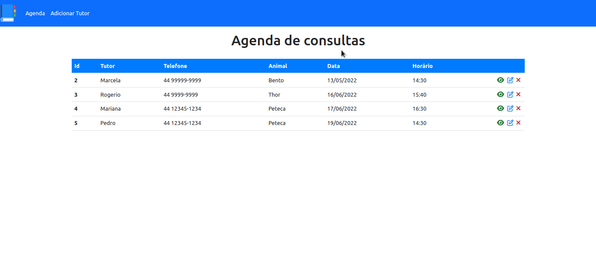
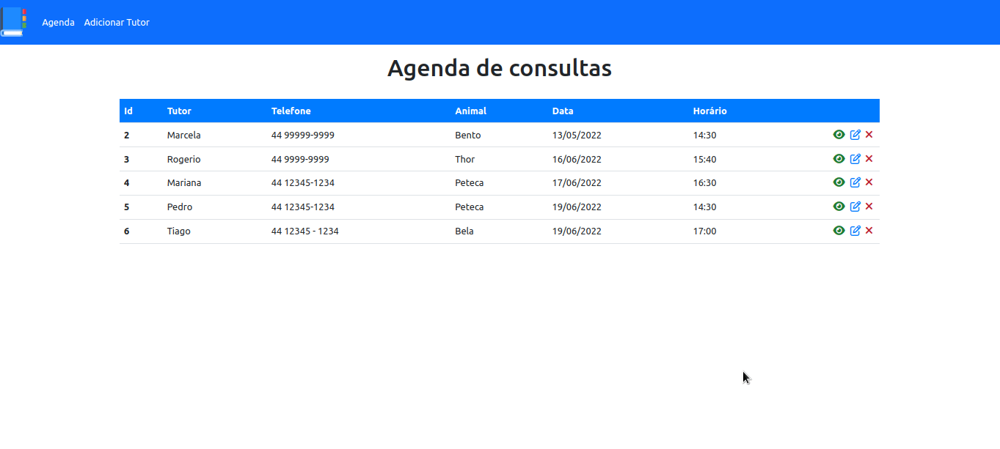
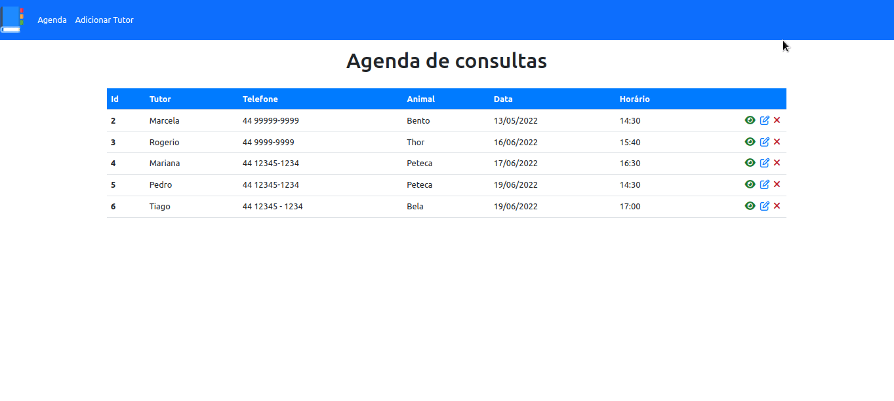
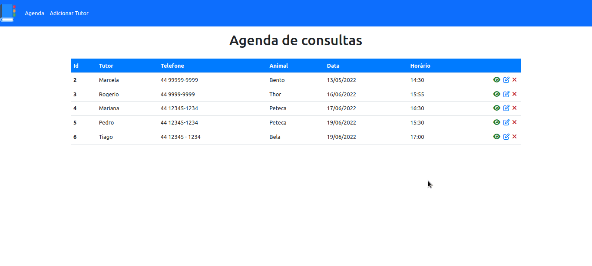

    

<h1>Projeto Agenda</h1>

Este projeto foi realizado durante o curso de PHP, ministrado pelo <a href="https://www.udemy.com/user/matheus-battisti/?gclid=Cj0KCQiA8aOeBhCWARIsANRFrQG_L_muRLSl42Kds4DNZsmK04oMrGvLAdrpcBRHR8MovYXr_OKqnrcaAmZJEALw_wcB">Matheus Battisti</a>. Esta aplicação foi desenvolvida em HTML5, PHP, CSS3 e utiliza SQL como banco de dados. Foi possivel aprender e praticar o CRUD.

Trata-se de uma agenda de consultas para uma clínica veterinária, na qual é possivel cadastrar o nome do tutor, animal, horario, data da consulta e algumas observações.

    <h5>CREATE</h5>
    

 

    <h5>READ</h5>
    

 

    <h5>UPDATE</h5>
    

 

    <h5>DELETE</h5>
    

